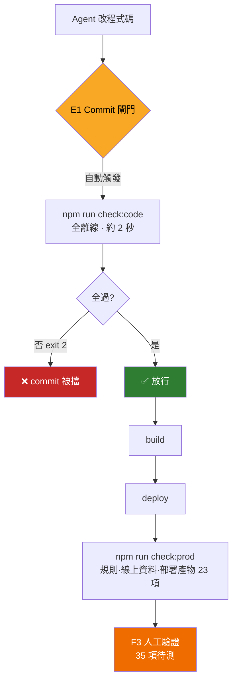

# Harness Engineering — Agent 工作流組件清冊

> 管理的是「**AI Agent 在這個專案裡怎麼工作**」,不是產品功能。
>
> 產品要做什麼 → [README.md](README.md)｜Agent 開工情境 → [CLAUDE.md](CLAUDE.md)｜系統怎麼實作 → [docs/wiki/Home.md](docs/wiki/Home.md)
>
> **要改動工作流本身(加檢查／加閘門／換驗證方式)→ 先讀這裡。**

## 第一性原理

Agent 是無狀態函數 `f(context) → action`,不記得上次、不能驗證自己、遵守指令的機率恆小於 1。四個推論各逼出一層:

| 層 | 推論 | 設計問題 |
|---|---|---|
| **情境 C** | 它不可能知道你沒放進 context 的事 | 用最少輸入讓它做對事 |
| **回饋 F** | 它無法裁決自己的產出對不對 | correctness externalize 成跑得起來的東西 |
| **強制 E** | 指令是機率影響,不是保證 | 重要規則靠結構,不靠請求 |
| **執行環境 R** | 它驗不了它跑不到的東西 | 能力邊界決定什麼能自動化 |

被工程化的對象**全都不是模型,是模型周圍的環境**。兩條衍生定理:

- **A｜沒人據以行動的訊號,比沒有訊號更糟。** 恆綠的檢查與正確性的互資訊為零,還會外溢——訓練讀者折價所有檢查。品質指標是「每單位注意力的資訊量」,不是檢查數量。
- **B｜把「應該記得做 X」換成「X 機械地發生」,就把機率性失效轉成結構性保證。** 投報率最高的一種交易。

---

## 組件總表

| ID | 組件 | 檔案 | 觸發者 | 狀態 |
|---|---|---|---|---|
| **C1** | Agent 情境檔 | [CLAUDE.md](CLAUDE.md) | 每輪自動載入 | ✅ 3.9 KB |
| **C2** | 系統 Wiki(13 篇) | [docs/wiki/](docs/wiki/) | 依 C1 路由表按需讀 | ✅ 無孤兒文件 |
| **C3** | 人類操作手冊 | [README.md](README.md) | 人 | ✅ |
| **F1** | 事故驅動回歸(39 項) | [scripts/check-known-bugs.mjs](scripts/check-known-bugs.mjs) | `check:code` / `check:prod` | ✅ 全過 |
| **F2** | 功能標準(40 項) | [scripts/check-functional.mjs](scripts/check-functional.mjs) | 同上 | ⚠️ 4 自動過,35 待測 |
| **F3** | 人工驗證帳本 | [scripts/functional-results.json](scripts/functional-results.json) | 人手動 `--pass` | ⚠️ 僅 1 筆,無時效性 |
| **F4** | 檢查路由 | [package.json](package.json) | 人 / E1 | ✅ 已拆 code/prod |
| **F5** | 交易流程 × 安全規則(49 項) | [scripts/check-trade-flow.mjs](scripts/check-trade-flow.mjs) | `check:trade`／`check:code`(自動 skip) | ✅ 全過 · 需 emulator |
| **F6** | Emulator 工具與種子 | [scripts/emulator-helpers.mjs](scripts/emulator-helpers.mjs)、[scripts/seed-emulator.mjs](scripts/seed-emulator.mjs) | `emu:seed` | ✅ |
| **E1** | Commit 閘門 | [.claude/settings.json](.claude/settings.json) | `git commit` 自動 | ✅ 已實測會擋 |
| **E2** | 個人權限白名單 | `.claude/settings.local.json` | Claude Code | ⚠️ 未版控、有死路徑 |
| **E3** | 執行期權限規則 | [firestore.rules](firestore.rules) | Firebase 執行期 | ✅ 版控中 |
| **R1** | Dev server | [.claude/launch.json](.claude/launch.json) | 瀏覽器驗證時 | ✅ :5173 |
| **R2** | Firebase 設定 | [firebase.json](firebase.json) | 部署 / F1 / F2 | ✅ 已有 emulators 區塊 |
| **R3** | 正式環境 `yabuy-2026a` | — | F1/F2 網路檢查對象 | ⚠️ 仍是 F1/F2 唯一資料來源 |
| **R4** | 本機 Emulator | auth 9099 / firestore 8080 / UI 4000 | `npm run emu`(**需 JDK**) | ✅ F5/F6 的執行環境 |
| **H2–H4** | 待建組件 | — | — | 📋 見下方規劃 |

---

## 流程



**核心設計:離線／線上分離。** `check:code` 只讀工作目錄,綠燈的意思是**我的改動安全**;`check:prod` 打正式站,它的紅燈可能是**世界變了**(使用者上架髒資料),所以不該擋 commit。含外生噪音的檢查不能當閘門。

---

## 組件詳述

只寫**其他文件沒有的部分**。檢查項目的內容細節不在這裡重複:

- F1 每一條在防哪個事故 → [回歸測試-已知事故.md](docs/wiki/回歸測試-已知事故.md)
- F2 的 40 項清單與 RUNNER 分類表 → [回歸測試-功能標準.md](docs/wiki/回歸測試-功能標準.md)

### C1 · `CLAUDE.md`

每輪自動載入,是唯一「不用問就知道」的東西。**定位是路由表,不是知識庫。**

- 常駐成本必須壓低。已移除可由 `git log` 重建的工作進度表(原佔 40%)
- **鐵則不要無限增加**:第 5 條已由 E1 強制,其餘仍靠自願
- 裡面的數字會過期(39/40/4 自動),未來由 **H3** 校驗

### C2 · `docs/wiki/`

13 篇 Obsidian 格式,`Home.md` 是索引。連結圖健康,無孤兒文件。

**現存漂移**(待 H3):`已知問題.md` #6 完全過期(title 早已改掉);#4 漂了一半——manifest 已補,但 service worker 確實仍未註冊,那半條還成立。

### F1 · 事故驅動回歸

39 項 = 原始碼不變式 16(離線) + 規則 9 + 線上資料 6 + 部署產物 8(共 23 需網路)。旗標 `--local` / `--prod`。

**准入條件(寫在腳本開頭):新增檢查前必須指出它擋得住哪個實際事故。** 通用最佳實踐請放 F2。這條是防止測試膨脹的設計,不是客套話。

選材原則:專挑「改壞了不會噴錯、但線上會出事」的類型——agent 最容易無聲回歸的地方。

### F2 · 功能標準

40 項,A 元件 / B 操作 / C 交易 / D 資料庫。與 F1 互補:F1 問「舊 bug 復發了嗎」(窄而深),F2 問「該有的功能正常嗎」(廣而完整)。

最有價值的設計是 **RUNNER 分類**——把「誰有能力執行這項驗證」編碼進工具。它與鐵則 #1(**不能代替使用者登入**)自洽:`AUTH`/`DUO` 卡住不是懶,是 agent 在結構上做不到。16 項 `DUO` 是 **H1** 的目標。

旗標 `--local` 會把需網路的 AUTO 標成 `[跳過]` 而非 `[待測]`,避免污染進度數字。

### F3 · 人工驗證帳本

**兩個結構性缺陷**(H2 要修):①需人手動登錄,實際沒人登錄 → 進度條永遠 13%,訓練所有人忽略它;②**紀錄永不過期** → 標了 pass 之後 `Deal.vue` 重寫十次它還是 pass。

### F4 · 檢查路由

```
check       = check:code + check:prod    完整,覆蓋範圍與拆分前一致
check:code  = F1 --local + F2 --local    全離線 · ~2 秒 · E1 用這條
check:prod  = F1 --prod  + F2            打正式站 · 部署後煙霧測試
check:bugs / check:func                  向後相容,舊指令保留
```

### E1 · Commit 閘門

把鐵則 #5 從「請 agent 記得」變成「做不到就是做不到」。

```
matcher: "Bash"  +  if: "Bash(git commit *)"   ← 精準攔截,不影響其他 Bash
  → npm run check:code
  → exit 0：放行 ／ exit 非 0：exit 2,擋下並印出失敗項目
```

- **已實測兩條分支**(用無害 `echo HOOKTEST_*` 加哨兵檔驗證觸發)。未經驗證的護欄不是護欄,是關於護欄的信念——hook 最常見的失效是靜默不觸發
- **保證範圍要誠實**:它保證「檢查跑過且通過」,不保證「改動是好的」。價值上限 = `check:code` 的覆蓋率
- ⚠️ **與 F4 有隱性耦合**:改 npm script 名稱要同步改這裡的 `command`,目前無自動關聯(見規則 4)

### E2 · `.claude/settings.local.json`

免詢問指令清單,**未進版控**。技術債:含上個 session 的死路徑(`f3e6b2c9-…`)與 `Read(//tmp/**)`。→ **H4**

### R1–R3 · 執行環境

`launch.json` dev server :5173｜`firebase.json` 目前**無 `emulators` 區塊**(H1 起點)｜本機開發所有讀寫直接打正式 Firestore/Auth/Storage——**這是 harness 最大的能力邊界**。

---

## 待建組件

### ✅ H1 · Emulator + 交易流程自動化 —— 已完成（2026-08-15）

實作成果見 **F5／F6／R4**。與原規劃的差異，以及兩個必須記住的結論：

**① 前置需求是 JDK，不是 Node。** Firestore emulator 是 JVM 程式。規劃時沒料到，
實際執行時整個卡住。這正好印證推論 4：能力邊界由環境決定，不由腳本品質決定。

**② 最大的收穫不是狀態機，是「第三個帳號」。** 原本以為主要價值在自動化 C-03～C-15，
實際上更值錢的是 emulator 讓我們能用**登入但無關的第三者**去試探規則——正式站上永遠
不敢這樣做。49 項裡有 13 項是這類隔離測試，全部通過，而它們**在此之前從未被驗證過**
（`check:prod` 只驗匿名讀取）。

**③ 沒有把 DUO 改成 AUTO。** F5 驗的是**資料層契約與安全規則**，不是 UI 行為。
功能標準裡「雙方信箱各自看得到」「顯示提示『賣家僅限改期一次』」這類敘述，F5 一項
都沒驗到。把 runner 改成 AUTO 會讓人以為驗過了，違反規則 5。路線 (b)（把狀態轉移
從 `Mailbox.vue`／`Deal.vue` 抽成共用模組）仍未動，那才是讓 DUO 真正變 AUTO 的前提。

#### F5 順帶發現的三個安全缺口 —— 已在規則層補上

F5 一上線就撈出三個「前端擋得住、後端擋不住」的缺口。**這正是這層測試的價值：
它們全都不是程式碼寫錯，而是規則從來沒有涵蓋，所以任何既有檢查都不會紅。**

| 缺口 | 原本 | 現在（`firestore.rules` 的 `orders`） |
|---|---|---|
| 改期次數上限 | 賣家 1 次／買家 2 次**只在 `Mailbox.vue` 前端擋** | `negotiationStepOk()`：只接受「不變」或「剛好 +1 且該角色未達上限」 |
| 不能買自己的商品 | **只在 `TradeModal.vue` 前端擋** | `create` 加 `buyerId != sellerId` |
| 訂單可被挾持 | 無任何防護（測試時才發現） | `immutablePartiesKept()`：`buyerId`/`sellerId`/`productId` 不可事後變更 |

規則的判斷條件是**對照 `Mailbox.vue:349-363` 的實際行為寫的**（`step + 1`、
賣家 `step >= 1` 擋、買家 `step >= 2` 擋），不是憑空設計，所以不會誤擋正常流程——
F5 第 6 節同時驗證了「合法遞增要允許」與「超過上限要擋」兩個方向。

F5 第 6 節已從 `note()`（記錄現況）升級成 `expectDenied()`／`expectAllowed()`
（防止退化），F5 總數 29 → 37 項。

> ⚠️ **這些規則要 `firebase deploy --only firestore:rules` 才會在正式站生效。**
> emulator 綠燈只代表規則本身正確，不代表正式站已經受保護。

### H1 原始規劃（保留備查）

F2 的 16 項 `DUO` 幾乎就是整個交易狀態機(C-03～C-15),也是最容易出錯的區域。卡住的唯一原因是**造不出買賣雙方**。

前置已就緒:`firebase-tools` 15.1.0、`functions/` 已有 `firebase-admin` 與 `firebase-functions-test`。

**⚠️ 接上 emulator 不會讓 16 項自動變綠。** 交易邏輯寫在元件內部(`Mailbox.vue` 674 行的 `runOrderAction`、`Deal.vue` 805 行的 `runOnce`),腳本無法 import 呼叫:

| | (a) Admin SDK 驅動 Firestore | (b) 抽出 `src/lib/orderFlow.js` |
|---|---|---|
| 驗到 | 資料層契約:規則、欄位、狀態轉移合法性 | 真正的產品邏輯(元件與測試共用) |
| 成本 | 低,純新增腳本 | 高,重構兩個最脆弱的檔案 |
| 風險 | 無 | 高,**必須 emulator 就位後才動** |

**建議:先 (a) 打基礎建設,再逐案 (b)。**

1. `firebase.json` 加 `emulators`(auth 9099／firestore 8080／functions 5001／storage 9199／ui 4000)
2. `src/firebase.js` 加 `connect*Emulator`,用 `import.meta.env.VITE_USE_EMULATOR` 開關(預設關,正式建置不受影響)
3. 新增 `scripts/seed-emulator.mjs`——造 buyer／seller／product／order 種子
4. 新增 `scripts/check-trade-flow.mjs`——驅動 pending → negotiating → accepted → scan → completed,斷言 `negotiationStep`／`cancelCount`／`products.status=sold`／`soldAt`
5. `package.json` 加 `emu`／`emu:seed`／`check:trade`
6. 納入 `check:code`,但**偵測不到 emulator 要 skip 而非 fail**,否則 E1 會在沒開 emulator 的機器上擋掉所有 commit
7. 逐案把 `DUO` 改 `AUTO`,同步更新 `回歸測試-功能標準.md` 的 RUNNER

順帶解決 `已知問題.md` #3。

### H2 · 人工紀錄時效性(改 F2 + F3)

1. `CASES` 每項加 `covers: ['src/components/Deal.vue', …]`
2. 比對 `git log -1 --format=%cI -- <file>` 與 `record.date`
3. 檔案較新 → 新增 `stale` 狀態、badge `[已過期]`,並指出**是哪個檔案動了**
4. F3 加 `commit` 欄位記錄當時 HEAD,比日期精準
5. 配合 H1 縮減人工清單

**時機正好**:目前只有 1 筆紀錄,現在改衝擊最小。

### H3 · 文件漂移偵測 `scripts/check-docs.mjs`

1. 斷言 CLAUDE.md 宣稱數字＝腳本實際數字(F1 項數、F2 案例數與 AUTO 數、Cloud Functions 匯出數)
   - 已核對:39／40／4 自動／4 支 Functions **目前全部正確**,這支是防未來漂移
2. `已知問題.md` 每條掛 check id,該 check 綠了就提示「可能已解決」
3. 修正現存漂移:#6 刪除、#4 改寫成只留 service worker 那半條
4. **順便關掉 E1↔F4 的隱性耦合**:斷言 `.claude/settings.json` 引用的 npm script 確實存在
5. 納入 `check:code`(純靜態,成本趨近於零)

### H4 · 清理 E2

共用權限移進 `.claude/settings.json`,清死路徑,`settings.local.json` 只留個人覆寫。

---

## 改動這套 Harness 的規則

1. **先判斷屬於哪一層**(C/F/E/R)再決定改哪個檔案。加檢查 → F;加閘門 → E;補文件 → C。
2. **F1 加檢查前必須指出它擋得住哪個實際事故。** 通用最佳實踐放 F2。
3. **不要把需要網路的檢查放進 `check:code`。** 那是 E1 的閘門,必須離線且快(現約 2 秒)。慢或不穩的閘門會被繞過。
4. **改 F4 的腳本名稱要同步改 E1 的 `command`。** 目前無自動關聯 → H3 第 4 點會關掉這個缺口。
5. **新增 F2 案例要同時給 `runner`**,並同步 `回歸測試-功能標準.md`。標錯會讓人以為 agent 能驗其實驗不了的東西。
6. **凡是腳本驗證得了的敘述,不要用散文維護** → 交給 H3。
7. **文件不要重複別的文件已經講過的話。** 沒人讀的文件是純負債;重複的文件是負債加漂移風險。細節留在單一事實來源,這裡只放指標。
8. **鐵則 #1 不可繞過**:需要登入的驗證,agent 必須明確說出哪一段沒驗到,不能假裝驗過。
